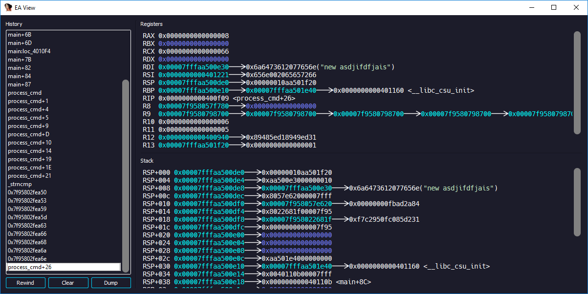
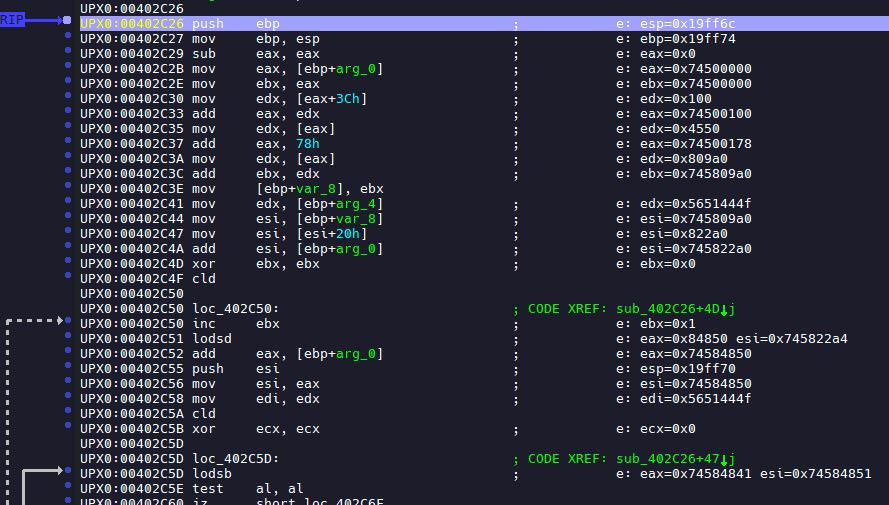
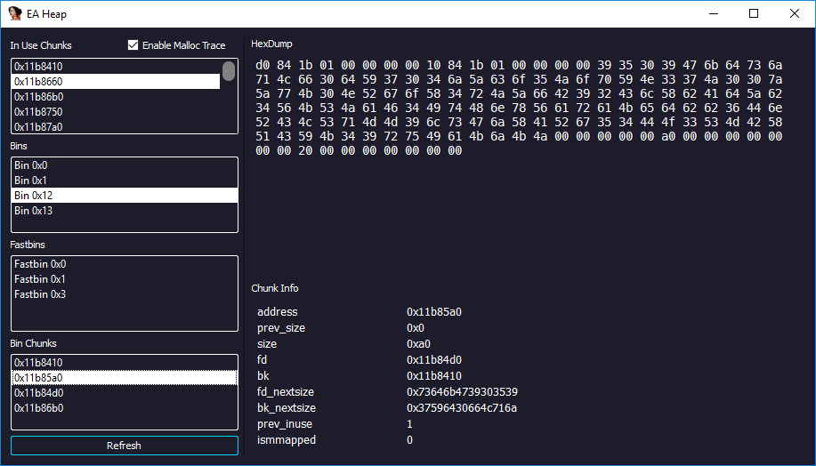
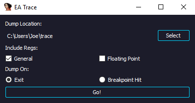
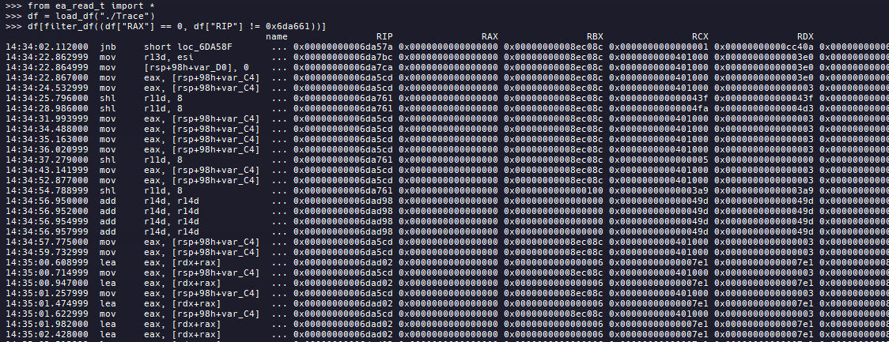
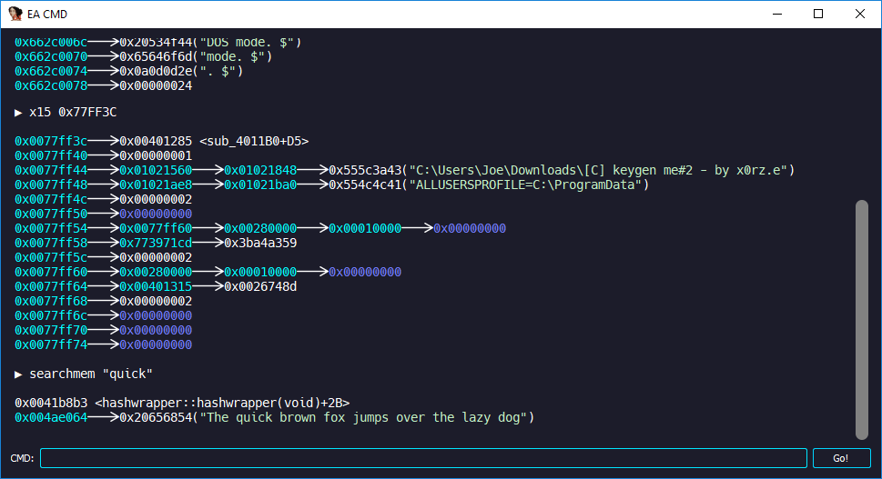
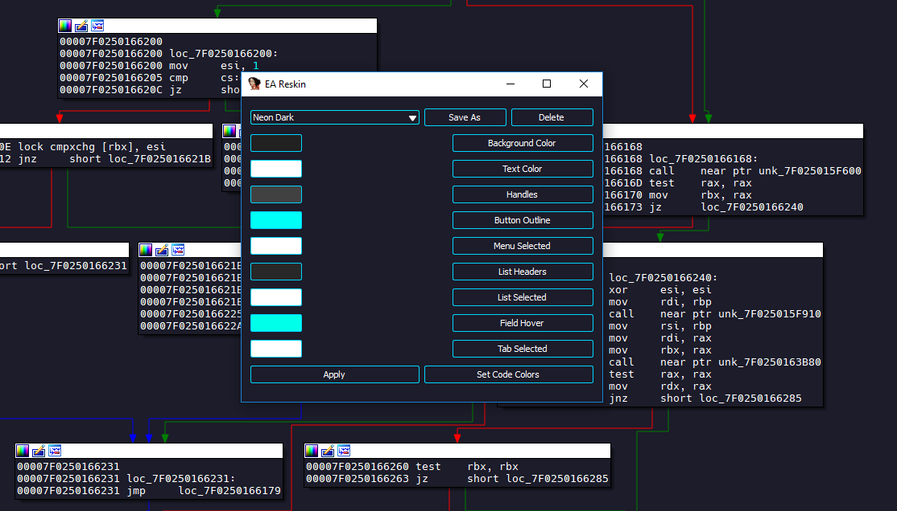

# IDA EA #

* **A Set of exploitation/reversing aids for IDA** 

## Features ##

### Context Viewer ###

New context  viewer for IDA, Features include:

* Recursive pointer derfereneces

* History browser

* Color coded memory

* Instruction rewind feature

* A similar interface to that of popular `GDB` plugings (eg. `PEDA/GEF`)

_______________

### Instuction Emulator ###

* Live annotate the results if furture instructions in IDA using the `Unicorn` CPU emulator
 

* Can be hooked to breakpoints

* Visualise instructions before execution

_______________

### Heap Explorer ### 

Explore current heap state of glibc binaries

* Trace allocations

* Enumerate bins 

* View all free and allocated chunks headers

* Useful for heap exploitation  /  debugging.

_______________

### Trace Dumper ### 

* Dump the results of an IDA trace into a Pandas Dataframe

* Analyze traces in Python using Pandas

_______________
### CMD ### 

* GDB bindings for IDA

* GDB style mem queries + searches

_______________
### Restyle ### 

* Restyle IDA using GUI.

___

# Install #

### Dependencies ###

No core dependencies for the plugin. Nevertheless certain fetures will be disabled without these python libraries installed:

##### Trace Dumper #####

* `Pandas` 

##### Instruction Emulator #####

* `Unicorn CPU emulator`
* `Capstone Dissasembler`

### Install ###

* Place `ida_ea` folder in `IDA Pro` directory  (`C:\Users\{name}\AppData\Roaming\Hex-Rays\IDA Pro` on Windows)
 
* Add line `from ida_ea import ea_main` to your `idapythonrc` file.

* Plugin is accessed via `IDA EA` tab added to the menu bar 

## Warning ##

* Only tested on Windows with `IDA 6.8`

* Only supports `x86/x86-64` binaries

* Alpha release so expect many bugs!

# Enjoy! #
